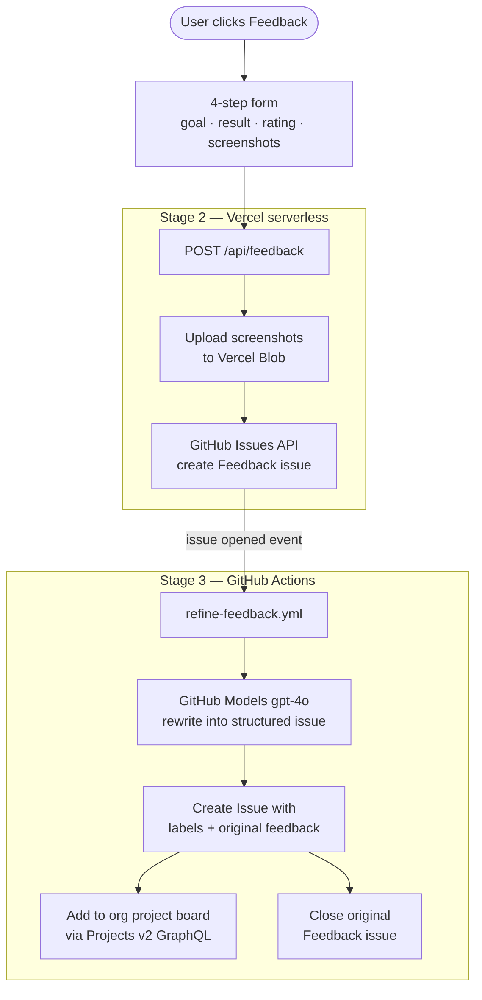
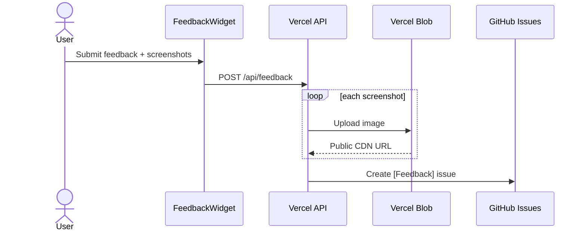
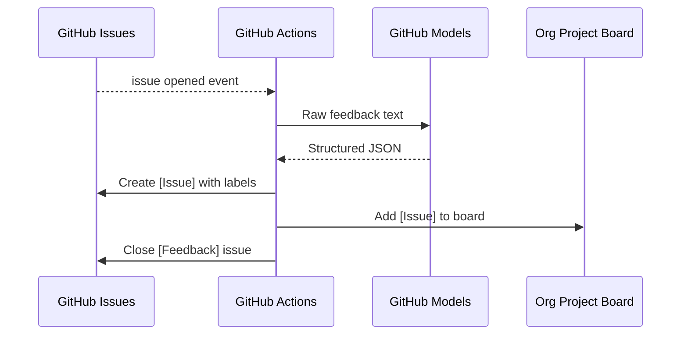

# Feedback Pipeline

This document describes the end-to-end feedback system built into the Building Configurator. It covers every step from a user clicking the **Feedback** button to a developer-ready card appearing on the organisation project board — with no manual intervention in between.

## Overview

The pipeline has three stages:



---

## Stage 1 — In-app widget

**File:** `src/app/components/FeedbackWidget.tsx`

A floating button (bottom-right corner) that opens a 4-step form:

| Step | What the user enters |
|------|----------------------|
| 1    | What they were trying to do |
| 2    | What happened / what they expected |
| 3    | Difficulty rating (1 = very easy … 5 = blocked) |
| 4    | Optional screenshots (screen capture or file upload, with crop) |

The widget is **context-aware**: it receives `view` (e.g. `"Configure"` or `"Map"`) and `context` (e.g. `"Building configurator open"`) from `App.tsx` and includes them in the submission. This tells the team exactly which screen the feedback came from.

Screenshots are encoded as base64 in the browser and sent as part of the JSON payload to `/api/feedback`. They are never stored client-side beyond the session.

---

## Stage 2 — Vercel serverless function

**File:** `api/feedback.ts`

A Vercel serverless function that runs on the same domain as the deployed app, so no CORS issues.

### What it does

1. **Receives** the JSON payload from the widget.
2. **Uploads each screenshot** to Vercel Blob (`feedback-screenshots/<timestamp>-<name>.png`) and gets back a permanent public CDN URL.
3. **Creates a GitHub issue** titled `[Feedback] <user goal>` with a structured Markdown body containing all fields and embedded screenshot images (via the CDN URLs).
4. Applies labels: `user-feedback`, `ux`, and a difficulty label (`feedback: easy` / `feedback: moderate` / `feedback: hard` / `feedback: blocked`).

### Why Vercel Blob for screenshots?

GitHub issue bodies accept Markdown images, but they must reference a public URL — you cannot embed base64 data directly. Vercel Blob provides cheap, public, permanent storage that works as a CDN. The `BLOB_READ_WRITE_TOKEN` is provisioned automatically when a Blob store is linked to the Vercel project.

### Required environment variables

Set these in the Vercel project settings (not committed to the repository):

| Variable | Purpose |
|---|---|
| `GITHUB_TOKEN` | PAT with `Issues: read/write` on the repo |
| `GITHUB_OWNER` | Repository owner (e.g. `THD-Spatial-AI`) |
| `GITHUB_REPO` | Repository name (e.g. `building-configurator`) |
| `BLOB_READ_WRITE_TOKEN` | Auto-set by Vercel when a Blob store is linked |

---

## Stage 3 — GitHub Actions refinement

### Workflow: `refine-feedback.yml`

Triggers on every `[Feedback]` issue opened by a human (the bot is explicitly excluded to prevent loops).

**What it does:**

1. Sends the raw issue title and body to **GitHub Models** (`gpt-4o`) with a structured system prompt.
2. The model rewrites the feedback into a developer-ready issue with sections: Summary, User Goal, Observed Behaviour, Expected Behaviour, Steps to Reproduce, Affected Component, Suggested Fix, Priority Rationale.
3. Creates a new `[Issue] <refined title>` with the structured body, the original screenshots re-embedded, and the raw feedback preserved in a collapsible `<details>` block for reference.
4. Applies labels: `needs-triage`, issue type (`bug` / `enhancement` / `ux`), and a priority label.
5. Adds the refined issue to the **THD-Spatial-AI org project board (#7)** via the GitHub Projects v2 GraphQL API using `ADD_TO_PROJECT_PAT`.
6. Closes the original `[Feedback]` issue (state: `completed`) to keep the issue list clean.

**Why not just use `add-to-org-project.yml`?**  
GitHub Actions workflows do not trigger other workflows when an action creates an issue using `GITHUB_TOKEN` — it is a deliberate security restriction. The project assignment is therefore done inline, using `ADD_TO_PROJECT_PAT` which has org-level project scope.

### Workflow: `add-to-org-project.yml`

Adds any newly opened issue or PR to the org project board. It skips `[Feedback]` issues (those are handled by `refine-feedback.yml` above — adding the raw issue would create duplicate cards).

### Required secrets

Set these in the repository or organisation secrets:

| Secret | Purpose |
|---|---|
| `ADD_TO_PROJECT_PAT` | PAT with `project` scope (org level) — used by both workflows |

> `GITHUB_TOKEN` is provided automatically by GitHub Actions and does not need to be set manually.

---

## Data flow summary

**Stages 1 & 2 — Widget to GitHub issue**



**Stage 3 — GitHub Actions refinement**



---

## Extending the widget

The UI (`FeedbackWidget.tsx`) and the pipeline are intentionally decoupled. The widget can be redesigned or extended (e.g. add a free-text field, component tagging, video capture) without touching any of the backend stages, as long as the payload sent to `POST /api/feedback` keeps the same shape:

```ts
{
  goal:        string;   // required
  result:      string;   // required
  rating:      number;   // 1–5
  view:        string;   // current screen name
  context:     string;   // optional extra context
  url:         string;
  timestamp:   string;   // ISO 8601
  screenshots: { name: string; data: string; mimeType: string }[];
}
```

Similarly, the AI prompt in `refine-feedback.yml` can be tuned independently of the widget — for example to classify issues differently, add a component taxonomy, or change the output template.
