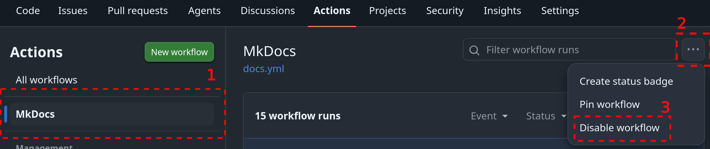
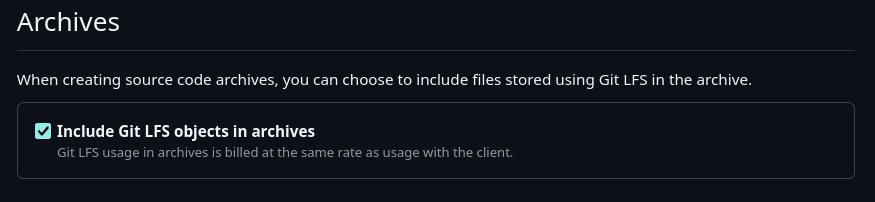

# MkDocs Setup

This template uses [MkDocs](https://www.mkdocs.org/) with the [Material for MkDocs](https://squidfunk.github.io/mkdocs-material/) theme for project documentation.

Documentation source files are located in the `docs/` directory.

---

## Run documentation locally

1. Install dependencies:

    ```bash
    pip install -r docs/requirements.txt
    ```

2. Start the local docs server:

    ```bash
    mkdocs serve
    ```

3. Open in your browser:

    ```
    http://localhost:8000/
    ```

    !!! note
        The port may vary based on configuration.

---

## Hosting documentation with GitHub Pages

This repository deploys documentation to **GitHub Pages** using a GitHub Actions workflow.

- **Workflow file:** `.github/workflows/docs.yml`

The workflow builds the MkDocs site and publishes it automatically when changes are pushed to the configured branch (for example, `main`).

!!! tip
    If your repository is **private**, the workflow will fail without GitHub Pro or Enterprise. In that case, disable the workflow temporarily until you are ready to make the repository public. Go to the **Actions** tab, select the workflow, and click **Disable workflow** in the right sidebar.

    

### Typical deployment flow

1. Update documentation files in `docs/` (and/or `mkdocs.yml`)
2. Commit and push changes to the default branch
3. GitHub Actions runs the docs workflow
4. The site is deployed to GitHub Pages automatically

### Configuration notes

- Make sure **GitHub Pages** is enabled in repository settings
- The Pages source should be set to **GitHub Actions**
- If using a project repository site, the published URL is typically:

    ```
    https://<org-name>.github.io/<repo-name>/
    ```

---

## Git LFS for large files

If your repository contains large files (datasets, binaries, media, generated assets), use Git LFS to keep the repository manageable.

!!! info
    For full documentation, see [Git LFS](https://git-lfs.com/).

### Basic setup

```bash
git lfs install
git lfs track "*.psd"
git lfs track "*.zip"
```

Then commit `.gitattributes` and your files as usual.

!!! note
    If you publish releases and want Git LFS files included in release archives, enable:

    **Settings → Archives → Include Git LFS objects in archives**

    

---

## Attribution

If your project uses third-party components, assets, or generated code that require attribution (e.g. UI components from Figma, design systems, libraries under Apache 2.0, BSD, or CC BY licenses), include an `ATTRIBUTIONS.md` file in the repository root.

At minimum, the attribution file should include:

| Field | Description |
|-------|-------------|
| Component / asset name | What you are using |
| Source platform or author | Where it came from |
| License type | Under what terms |
| Link to original source | URL to the original |

!!! warning
    If a third-party asset's license requires attribution, you are legally required to include it. Do not remove attribution notices from generated or imported code.
