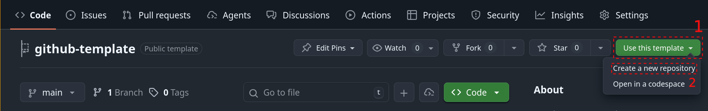

# THD-Spatial GitHub Template

Welcome to the THD-Spatial GitHub Template documentation! This template helps group members create standardized, open-source ready repositories.

## Quick Overview

This template repository provides a complete starting point for open-sourcing projects under the THD-Spatial organization. It includes essential files, guidelines, and a comprehensive checklist to ensure your project meets all requirements.

## What's Included

- **Essential Documentation Templates**: LICENSE, README, CONTRIBUTING
- **Open Source Checklist**: Step-by-step verification of requirements
- **Git LFS Configuration**: For managing large data files
- **MkDocs Setup**: For creating project documentation sites
- **Repository Naming Guidelines**: Best practices for consistent naming
- **Additional Document list**: Optional but useful files for project maintenance and community engagement

## Getting Started

1. **Use this template**: Click `Use this template -> Create a new repository` button on GitHub

    

2. **Name your repository**: Follow the [Repository Naming Guidelines](getting-started/repository-naming.md)
3. **Complete checklist**: Use [Open Source Checklist](getting-started/open-source-checklist.md) to track progress
4. **Customize files**: Update all template files for your specific project
5. **Make it public**: Once all requirements are met, publish your repository

## Key Requirements

!!! warning "Before Going Public"
    Your repository **must** include a [LICENSE](getting-started/open-source-checklist.md#license) file before it can be made public under the THD-Spatial organization.

### Essential Files

- **LICENSE** - Required for all public repositories
- **README.md** - Project overview and documentation
- **CONTRIBUTING.md** - Guidelines for contributors
- **CODE_OF_CONDUCT.md** - Community standards

### Data Management

- **Git LFS** - Required for repositories with large data files

## Next Steps

- [Open Source Checklist](getting-started/open-source-checklist.md) - Complete all requirements
- [Repository Naming Guidelines](getting-started/repository-naming.md) - Learn about naming conventions

## Support

For questions or issues with this template, please [open an issue](https://github.com/thd-spatial/github-template/issues) or contact the THD-Spatial group administrators.
